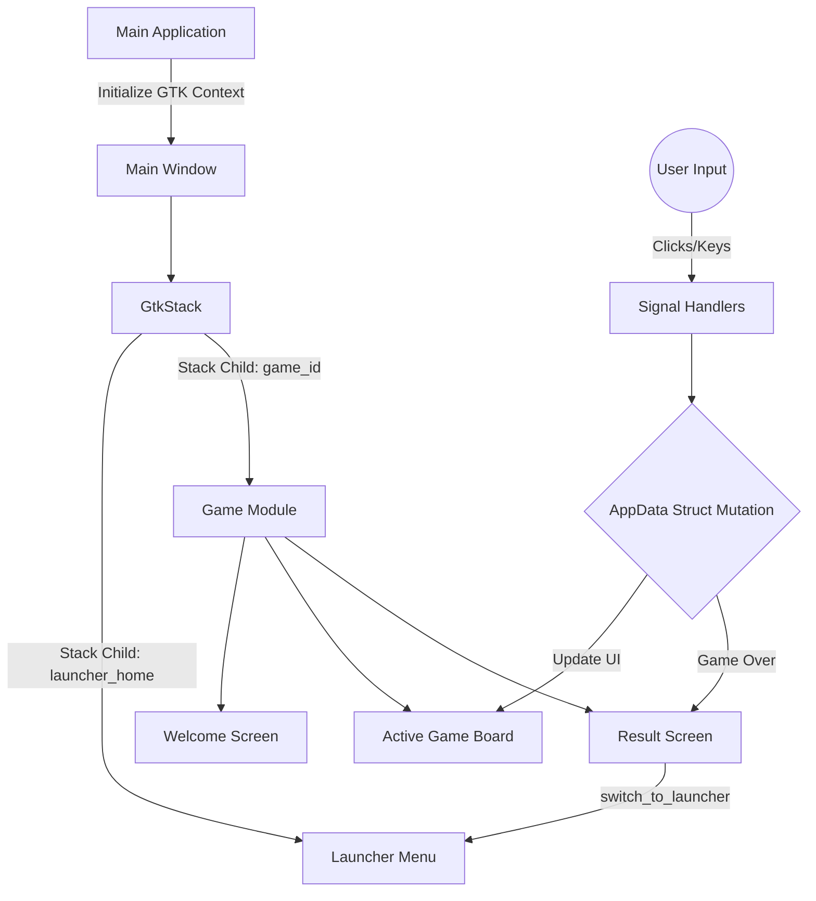

# Architecture & Design

This document details the internal architecture, design boundaries, and state-management protocols of the **C Games Collection**. It is intended for contributors maintaining or scaling the system.

## 1. Unified Binary & View Management

The repository uses a **Unified Binary Architecture** managed by a central GTK event loop. Rather than spawning independent executables, all games are compiled into a single application (`c-games-collection.exe`).

### View Navigation Flow
When a user launches the application:
1. The main entry point initializes the GTK4 application and constructs a `GtkStack`.
2. The `GtkStack` holds the launcher menu and every game as separate child views.
3. When a user selects a game from the launcher menu, the application invokes `gtk_stack_set_visible_child_name` to transition the view.
4. When the user clicks "Return to Main Menu" from within a game, the game invokes the `switch_to_launcher()` shared function (transitioning the stack back to the menu) and resets its internal logic.

**Design Rationale:**
A unified binary eliminates the overhead of managing OS-level processes and provides instant, seamless transitions between games while keeping the distribution to a single executable.



## 2. State Encapsulation (`AppData`)

In standard C GUI development, global variables are occasionally used to track widgets and state across callback scopes. This repository relies strictly on context structs instead of global state variables.

Every game module defines an `AppData` struct inside its `main.c` to encapsulate its internal state:

```c
// Example AppData Pattern
typedef struct {
    int current_score;
    char player_name[50];
    
    // UI References
    GtkWidget *window;
    GtkWidget *stack;
    GtkWidget *score_label;
} AppData;
```

During initialization, `AppData` is allocated dynamically on the heap (`g_new0`), and a pointer to this context object is passed explicitly into every GTK signal handler as `user_data`. 
This guarantees that memory from one game module cannot leak or interfere with another session, simulating process isolation within a unified binary.

## 3. Data Persistence Engine

The project implements a centralized data storage layer in `src/common/persistence.c`. 
It utilizes the `GKeyFile` engine to parse and write standard INI configuration files to the disk (`data/`).

**Key features:**
- Provides atomic saves for high scores and application configurations.
- Integrates with GTK-compliant structured logging (`g_message`, `g_warning`) for I/O operations.
- Strictly decouples file I/O logic from UI rendering logic.

## 4. UI Rendering & CSS Decoupling

GTK4 relies strictly on XML (`.ui` files) or programmatic C instantiation for the widget tree, and CSS for styling. 
This repository opts for **programmatic instantiation** in C to keep build dependencies minimal, while styling is decoupled into `.css` assets located in `assets/css/`.

When the application starts, `load_css_from_file()` builds an absolute path to the styling assets, dynamically streams the CSS into a `GtkCssProvider`, and binds it natively to the `GdkDisplay`. This enables rapid styling iteration across all integrated modules without requiring complex asset compilation steps.
