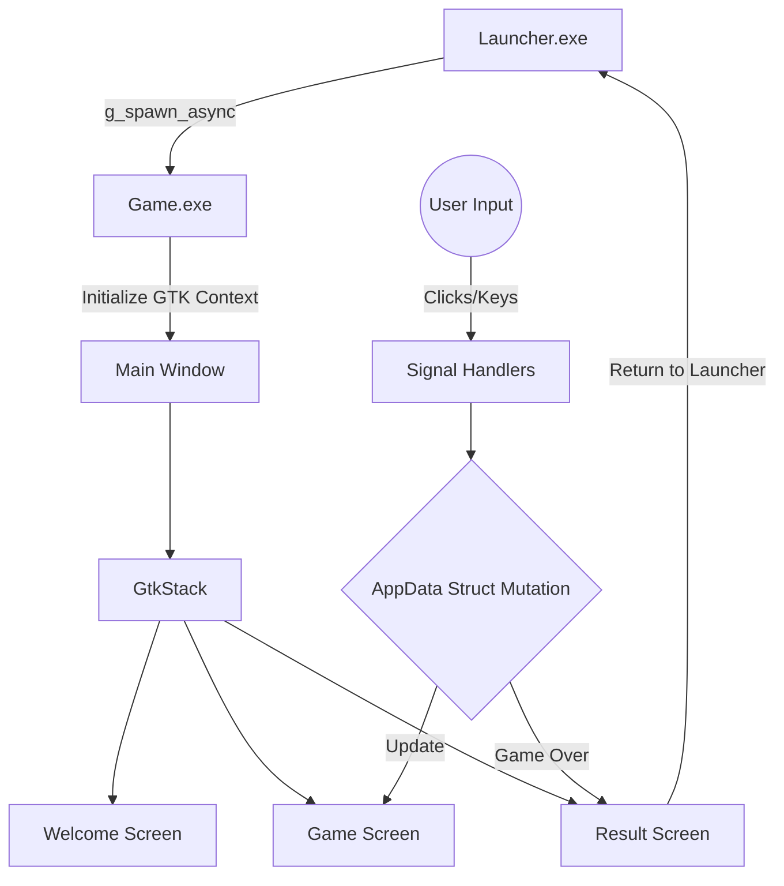

# Architecture & Design

This document details the internal architecture, design boundaries, and state-management protocols of the **C Games Collection**. It is intended for contributors maintaining or scaling the system.

## 1. Process Isolation

The repository uses an **Event-Driven, Multi-Process Architecture** rather than compiling into a single monolithic binary. Each game, including the central launcher, is compiled as an independent executable (`.exe`).

### Multi-Process Flow
When a user launches a game from the `launcher.exe` interface:
1. The launcher invokes GLib's `g_spawn_async` to execute the target game's binary natively on the host OS.
2. The launcher shuts down its GTK application loop (`gtk_window_close`).
3. The newly spawned game binary initializes its own GTK4 context, loads its memory structures, and renders the UI.
4. When the user clicks "Return to Main Menu" from within a game, the game invokes the `return_to_launcher()` shared function (spawning the launcher back) and terminates itself.

**Design Rationale:**
By relying on the operating system to govern process lifecycles, state memory from one game cannot leak or interfere with another session.



## 2. State Encapsulation (`AppData`)

In standard C GUI development, global variables are occasionally used to track widgets and state across callback scopes. This repository relies strictly on context structs instead of global state variables.

Every game module defines an `AppData` struct inside its `main.c`:

```c
// Example AppData Pattern
typedef struct {
    int current_score;
    char player_name[50];
    
    // UI References
    GtkWidget *window;
    GtkWidget *stack;
    GtkWidget *score_label;
} AppData;
```

During initialization (`activate`), `AppData` is allocated dynamically on the heap (`g_new0`), and a pointer to this context object is passed explicitly into every GTK signal handler as `user_data`. 

## 3. Data Persistence Engine

The project implements a centralized data storage layer in `src/common/persistence.c`. 
It utilizes the `GKeyFile` engine to parse and write standard INI configuration files to the disk (`data/`).

**Key features:**
- Provides atomic saves for high scores and configuration.
- Integrates with GTK-compliant structured logging (`g_message`, `g_warning`) for IO operations.
- Decouples file IO logic from UI rendering logic.

## 4. UI Rendering & CSS Decoupling

GTK4 relies strictly on XML (`.ui` files) or programmatic C instantiation for the widget tree, and CSS for styling. 
This repository opts for **programmatic instantiation** to keep dependencies minimal, while styling is decoupled into `.css` assets located in `assets/css/`.

When an application starts, `load_css_from_file()` builds an absolute path to the styling assets, dynamically streams the CSS into a `GtkCssProvider`, and binds it natively to the `GdkDisplay`. This enables styling iteration without requiring binary recompilation.
