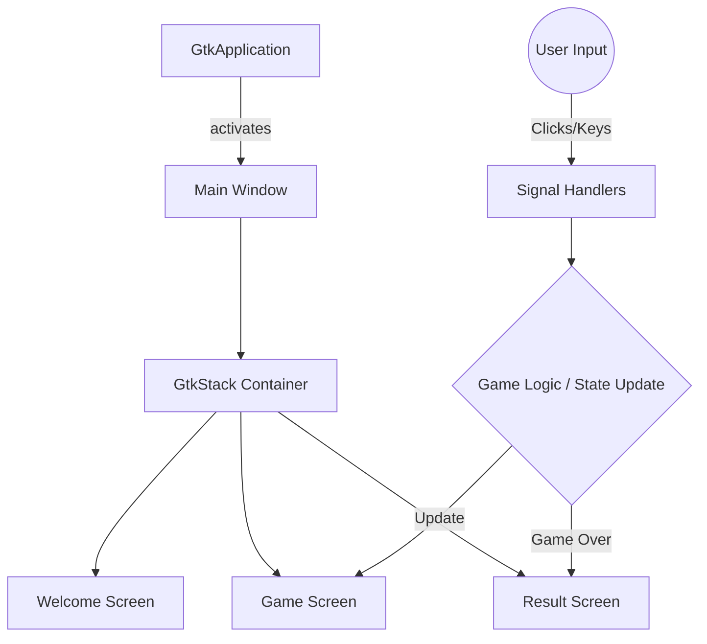

# 🎮 C Games Collection

A curated collection of classic mini-games developed entirely in C, featuring modern Graphical User Interfaces (GUIs) powered by GTK4. 

## Project Overview

The **C Games Collection** is a desktop application repository that demonstrates how to build interactive, state-driven games using the C programming language and the GTK4 toolkit. 

### Why it exists
While C is traditionally used for systems programming and backend services, this project exists to showcase that C can be used to build beautiful, responsive, and modern desktop applications. 

### The problem it solves
It serves as an excellent educational resource for developers wanting to learn:
- GTK4 application lifecycle
- Event-driven programming in C
- UI/UX design using CSS styling within C applications
- State management without object-oriented paradigms

### Key business value
Provides a foundational template for building GTK4 desktop applications, demonstrating clean code structure, CSS integration, and responsive UI components.

---

## 📸 Screenshots / Demo

*(Placeholders for screenshots)*

| Number Guessing | Rock Paper Scissors | Snake Gun Water | Tic Tac Toe |
| :---: | :---: | :---: | :---: |
|  |  |  |  |

---

## ✨ Features

### Game Features
* **Number Guessing Game**: Dynamic feedback, attempt tracking, and performance-based praise.
* **Rock Paper Scissors**: 3-round battles against the computer with live score tracking.
* **Snake Gun Water**: A variation of RPS with unique emoji-based UI and logic.
* **Tic Tac Toe**: 2-player local multiplayer with dynamic grid updates and win detection.

### System Features
* **Modern GUI**: Completely graphical interfaces replacing traditional CLI implementations.
* **CSS Styling**: Beautifully styled components, cards, hover effects, and typography using GTK4 CSS providers.
* **Page Navigation**: Smooth screen transitions (Welcome -> Game -> Result) using `GtkStack`.
* **State Management**: Robust internal state tracking for scores, rounds, and player names.

---

## 🛠 Technology Stack

| Layer | Technology |
| --- | --- |
| **Language** | C (C99/C11) |
| **GUI Toolkit** | GTK4 |
| **Styling** | CSS (Injected via `GtkCssProvider`) |
| **Compiler** | GCC / Clang |
| **Build System** | Make / CMake (Recommended) |

---

## 🏗 Architecture

The project follows an Event-Driven Architecture typical for GUI applications. Each game is a standalone GTK4 application containing its own state structure and UI lifecycle.



### Component Relationships
- **State Structs (`GameState` / `AppData`)**: Centralized memory structs holding player scores, names, and current rounds.
- **UI Builders**: Functions dedicated to constructing widget trees (e.g., `create_welcome_page`, `create_game_page`).
- **Callbacks**: Signal handlers attached to buttons (`on_start_clicked`, `on_cell_clicked`) that mutate state and trigger UI updates.

---

## 📁 Project Structure

```text
C-GAMES-COLLECTION/
├── games/
│   ├── number-guessing/
│   │   ├── main.c          # Logic and UI for Number Guessing
│   │   └── main.exe        # Compiled executable
│   ├── rock-paper-scissors/
│   │   ├── main.c          # Logic and UI for Rock Paper Scissors
│   │   └── main.exe        # Compiled executable
│   ├── snake-gun-water/
│   │   ├── main.c          # Logic and UI for Snake Gun Water
│   │   └── main.exe        # Compiled executable
│   └── tic-tac-toe-gui/
│       ├── main.c          # Enhanced GTK4 Tic Tac Toe with UX improvements
│       └── main.exe        # Compiled executable
└── README.md               # Project documentation
```

**Major Directories:**
- `games/`: Contains individual game folders. Each subfolder is a completely independent project and executable.

---

## ⚙️ Prerequisites

To compile and run these games from source, you must have the following installed on your system:

* **C Compiler**: `gcc` or `clang`
* **GTK4 Development Libraries**: 
  * *Linux (Ubuntu/Debian)*: `sudo apt install libgtk-4-dev`
  * *Windows*: MSYS2 with `mingw-w64-x86_64-gtk4`
  * *macOS*: `brew install gtk4`
* **pkg-config**: For resolving library flags during compilation.

---

## 🚀 Installation & Setup

1. **Clone the repository**
   ```bash
   git clone https://github.com/yourusername/C-GAMES-COLLECTION.git
   cd C-GAMES-COLLECTION
   ```

2. **Navigate to a game directory**
   ```bash
   cd games/tic-tac-toe-gui
   ```

3. **Compile the source code**
   Using GCC and `pkg-config`:
   ```bash
   gcc main.c -o main.exe `pkg-config --cflags --libs gtk4`
   ```
   *(Note: On Windows MSYS2, use `pkg-config --cflags --libs gtk4` appropriately within your mingw64 shell).*

---

## 💻 Running the Project

### Development / Local Mode

Once compiled, execute the generated binary directly.

**On Linux/macOS:**
```bash
./main
```

**On Windows:**
```cmd
main.exe
```

*Note: Ensure your environment variables (like `PATH` on Windows) include the GTK4 `bin` directories so dynamic linked libraries (`.dll`s) are found at runtime.*

---

## 🧪 Testing

Currently, the games rely on manual testing. 
To verify functionality:
1. Launch the executable.
2. Enter player details to pass validation checks.
3. Play a complete cycle (until Result Screen).
4. Use the "Play Again" / "Rematch" buttons to ensure state properly resets.
5. Exit using the application buttons to ensure memory is released and app terminates correctly.

---

## 📦 Build & Deployment

As these are standalone desktop applications, deployment involves compiling binaries for target operating systems.

**Windows Distribution:**
- Compile using MSYS2.
- Bundle the resulting `main.exe` with required GTK4 `.dll` files (using tools like `ldd` or MSYS2 deployment scripts) into a ZIP archive or installer.

**Linux Distribution:**
- Applications can be packaged as Flatpaks, AppImages, or native `.deb`/`.rpm` packages depending on the target ecosystem.

---

## ⚡ Performance Optimizations

* **Memory Management**: UI elements are managed by the GTK framework's reference counting system. Stack containers ensure inactive screens are hidden rather than destroyed/recreated continuously, reducing CPU overhead.
* **Inline CSS**: CSS data is compiled directly into the binary as C-strings (`css_data`), avoiding external file I/O operations at runtime.

---

## 🐛 Troubleshooting

| Issue | Cause | Fix |
| :--- | :--- | :--- |
| **"gtk/gtk.h: No such file or directory"** | GTK4 headers not found during compilation. | Ensure GTK4 development packages are installed and `pkg-config` is correctly setup in your PATH. |
| **Application crashes instantly on Windows** | Missing DLLs in the runtime environment. | Run the `.exe` from the MSYS2 Mingw64 shell, or copy the required GTK `.dll` files into the executable's folder. |
| **CSS Styles not applying** | GTK Theme overrides or missing provider priority. | The code uses `GTK_STYLE_PROVIDER_PRIORITY_APPLICATION`/`USER`. Ensure your environment doesn't strictly force high-contrast overriding themes. |

---

## 🗺 Roadmap

- [ ] **Cross-Game Menu**: Create a master launcher `main.exe` in the root folder to select and launch any of the 5 games.
- [ ] **Data Persistence**: Implement SQLite or local file I/O to save high scores and player histories between sessions.
- [ ] **AI Opponent for Tic-Tac-Toe**: Add a single-player mode with a Minimax algorithm for the computer.
- [ ] **Audio Feedback**: Integrate a lightweight audio library (e.g., SDL_mixer or Miniaudio) for button clicks and win/loss sound effects.
- [ ] **Makefiles**: Add a standard `Makefile` or `CMakeLists.txt` for easier automated building.

---

## 🤝 Contributing

Contributions are welcome! Please follow this workflow:

1. **Fork the repository**
2. **Create a feature branch**: `git checkout -b feature/awesome-new-game`
3. **Commit your changes**: `git commit -m 'Add space invaders clone'`
4. **Push to the branch**: `git push origin feature/awesome-new-game`
5. **Open a Pull Request**

### Coding Standards
- Maintain strict C99 or C11 standards.
- UI construction should be cleanly separated from Game Logic.
- Document internal states and use consistent variable naming (`snake_case`).
- Ensure no memory leaks when manually allocating pointers (though GTK handles most UI widgets).

---

## 📝 License

This project is licensed under the [MIT License](LICENSE).

---

## 🙌 Credits

* **GTK Project**: For the incredible GTK4 cross-platform UI toolkit.
* **Sujay Paul**: Lead Developer and creator of the UI designs and game logic.

---

## 📞 Support

If you encounter any issues compiling or running the games, please open an **Issue** on the repository with your operating system details and compiler logs. 

---

## 🙏 Acknowledgements

A special thanks to the open-source community for providing accessible documentation on GTK4 C programming, enabling the creation of these modern applications.
