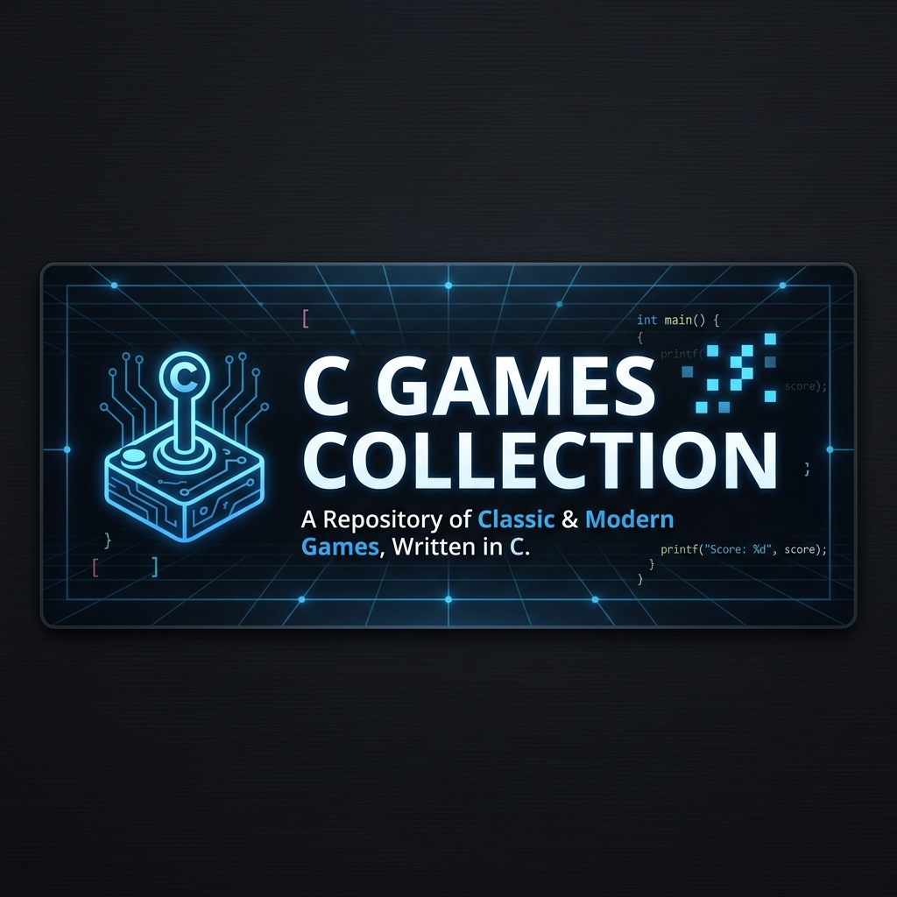

# 🎮 C Games Collection

[](https://github.com/sujay/c-games-collection/actions)
[](https://opensource.org/licenses/MIT)
[](http://makeapullrequest.com)

A curated collection of classic mini-games developed entirely in C, featuring modern Graphical User Interfaces (GUIs) powered by GTK4. 

## Project Overview

The **C Games Collection** is a desktop application repository that demonstrates how to build interactive, state-driven games using the C programming language and the GTK4 toolkit. 

### Why it exists
While C is traditionally used for systems programming and backend services, this project exists to showcase that C can be used to build beautiful, responsive, and modern desktop applications. 

### The problem it solves
It serves as an excellent educational resource for developers wanting to learn:
- GTK4 application lifecycle
- Event-driven programming in C
- UI/UX design using CSS styling within C applications
- State management without object-oriented paradigms

### Key business value
Provides a foundational template for building GTK4 desktop applications, demonstrating clean code structure, CSS integration, responsive UI components, and resilient inter-process communication logic.

---

## 📸 Screenshots / Demo

*Please capture screenshots and save them in the `assets/screenshots/` directory using the naming convention below.*

| Number Guessing | Rock Paper Scissors | Snake Gun Water | Tic Tac Toe |
| :---: | :---: | :---: | :---: |
|  |  |  |  |

---

## ✨ Features

### Game Features
* **Number Guessing Game**: Dynamic feedback, attempt tracking, and performance-based praise.
* **Rock Paper Scissors**: 3-round battles against the computer with live score tracking.
* **Snake Gun Water**: A variation of RPS with unique emoji-based UI and logic.
* **Tic Tac Toe**: 2-player local multiplayer with dynamic grid updates and win detection.

### System Features
* **Central Launcher**: A master menu to seamlessly navigate between games.
* **Modern GUI**: Completely graphical interfaces replacing traditional CLI implementations.
* **CSS Styling & Themes**: Beautifully styled components, cards, hover effects, and live theme switching (e.g., Hacker Mode) via GTK4 CSS providers.
* **Page Navigation**: Smooth screen transitions (Game -> Result) using `GtkStack`.
* **Robust Persistence**: Cross-session state management using GLib's `GKeyFile` INI parser for saving high scores and global player profiles without data corruption risks.

---

## 🛠 Technology Stack

| Layer | Technology |
| --- | --- |
| **Language** | C (C99/C11) |
| **GUI Toolkit** | GTK4 |
| **Data Persistence**| GLib (`GKeyFile` INI parsing) |
| **Styling** | CSS (Injected via `GtkCssProvider`) |
| **Compiler** | GCC / Clang |
| **Build System** | GNU Make |

---

## 🏗 Architecture

The project follows an Event-Driven Architecture typical for GUI applications. Each game, along with the central launcher, is compiled as an independent GTK4 executable. The launcher asynchronously spawns game processes to navigate the arcade, ensuring strict memory isolation between applications.

For an in-depth breakdown of process boundaries, UI state management, and the `GKeyFile` persistence engine, see the [ARCHITECTURE.md](ARCHITECTURE.md) documentation.

---

## 📁 Project Structure

```text
C-GAMES-COLLECTION/
├── src/
│   ├── common/             # Shared persistence and CSS engine
│   ├── launcher/           # Central Arcade Launcher
│   ├── number_guessing/    # Number Guessing logic and UI
│   ├── rock_paper_scissors/# Rock Paper Scissors logic and UI
│   ├── snake_gun_water/    # Snake Gun Water logic and UI
│   └── tic_tac_toe/        # Tic Tac Toe logic and UI
├── assets/
│   └── css/                # Isolated stylesheet themes
├── tests/
│   └── test_persistence.c  # GLib unit tests for the data layer
├── Makefile                # Automated build script
└── README.md               # Project documentation
```

**Major Components:**
- `src/`: Core directory containing modular, independent C source directories. Games communicate via OS processes and share the `src/common` modules cleanly.
- `bin/` (auto-generated): Where all compiled `.exe` files and `.ini` save files are stored.

---

## ⚙️ Prerequisites

To compile and run these games from source, you must have the following installed on your system:

* **C Compiler**: `gcc` or `clang`
* **Make**: GNU Make or `mingw32-make`
* **GTK4 Development Libraries**: 
  * *Linux (Ubuntu/Debian)*: `sudo apt install libgtk-4-dev`
  * *Windows*: MSYS2 with `mingw-w64-x86_64-gtk4`
  * *macOS*: `brew install gtk4`
* **pkg-config**: For resolving library flags during compilation.

---

## 🚀 Installation & Setup

1. **Clone the repository**
   ```bash
   git clone https://github.com/yourusername/C-GAMES-COLLECTION.git
   cd C-GAMES-COLLECTION
   ```

2. **Compile the entire collection**
   Using GNU Make (or `mingw32-make` on Windows):
   ```bash
   make all
   ```
   *This will automatically generate the `bin/` directory and compile the launcher and all 4 games using `pkg-config --cflags --libs gtk4`.*

---

## 💻 Running the Project

Once compiled, execute the central launcher from the `bin` directory to access the games.

**On Linux/macOS:**
```bash
./bin/launcher.exe
```

**On Windows:**
```cmd
bin\launcher.exe
```

*Note: Ensure your environment variables (like `PATH` on Windows) include the GTK4 `bin` directories so dynamic linked libraries (`.dll`s) are found at runtime.*

---

## 🧪 Testing

The repository utilizes the `g_test` framework to run automated headless unit tests against the `GKeyFile` persistence engine, verifying that data boundaries (like strings containing newlines) are properly escaped.

To run the automated test suite:
```bash
make test
```

For UI testing, manually verify functionality:
1. Launch `launcher.exe`.
2. Ensure theme switching dynamically applies to all GTK elements.
3. Play a complete cycle (until Result Screen).
4. Exit using the "Return to Launcher" buttons to ensure the OS gracefully handles the cross-process spawning.

---

## 📦 Build & Deployment

As these are standalone desktop applications, deployment involves compiling binaries for target operating systems.

**Windows Distribution:**
- Compile using MSYS2.
- Bundle the resulting `bin/` directory with required GTK4 `.dll` files (using tools like `ldd` or MSYS2 deployment scripts) into a ZIP archive or installer.

**Linux Distribution:**
- Applications can be packaged as Flatpaks, AppImages, or native `.deb`/`.rpm` packages depending on the target ecosystem.

---

## ⚡ Performance Optimizations

* **Memory Management**: UI elements are managed by the GTK framework's reference counting system. Stack containers ensure inactive screens are hidden rather than destroyed/recreated continuously, reducing CPU overhead.
* **Asset Isolation**: CSS styling is fully decoupled into standard `.css` files located in `assets/css/`, loaded dynamically at runtime via `g_build_filename` to prevent binary bloating while ensuring extreme flexibility.
* **Atomic Save States**: The `GKeyFile` parser is highly optimized for writing standard INI files safely, preventing UI blocking or corruption during fast data persistence.

---

## 🐛 Troubleshooting

| Issue | Cause | Fix |
| :--- | :--- | :--- |
| **"gtk/gtk.h: No such file or directory"** | GTK4 headers not found during compilation. | Ensure GTK4 development packages are installed and `pkg-config` is correctly setup in your PATH. |
| **Application crashes instantly on Windows** | Missing DLLs in the runtime environment. | Run the `.exe` from the MSYS2 Mingw64 shell, or copy the required GTK `.dll` files into the executable's folder. |
| **"Failed to return to launcher" Dialog** | Operating System path resolution failed. | Ensure you are launching the games via `launcher.exe` inside the `bin/` directory, rather than executing the game binaries from a separate arbitrary working directory. |

---

## 🗺 Roadmap

- [x] **Cross-Game Menu**: Create a master launcher `main.exe` in the root folder to select and launch any of the 5 games.
- [x] **Data Persistence**: Implement local INI file I/O to save high scores and player histories between sessions.
- [x] **Makefiles**: Add a standard `Makefile` for automated cross-compiling.
- [ ] **AI Opponent for Tic-Tac-Toe**: Add a single-player mode with a Minimax algorithm for the computer.
- [ ] **Audio Feedback**: Integrate a lightweight audio library (e.g., SDL_mixer or Miniaudio) for button clicks and win/loss sound effects.
- [ ] **Cross-Process API**: Shift from standalone binaries to a dynamically loaded library (`.so`/`.dll`) architecture for unified memory.

---

## 🤝 Contributing

Contributions are welcome! Please read our [Contributing Guidelines](CONTRIBUTING.md) to understand our branching strategy, workflow, and code style.

Once your Pull Request is merged, you will be added to the [Contributors List](CONTRIBUTORS.md).

---

## 📝 License

This project is licensed under the [MIT License](LICENSE).

---

## 🙌 Credits

* **GTK Project**: For the incredible GTK4 cross-platform UI toolkit.
* **Sujay Paul**: Lead Developer and creator of the UI designs and game logic.

---

## 📞 Support

If you encounter any issues compiling or running the games, please open an **Issue** on the repository with your operating system details and compiler logs. 

---

## 🙏 Acknowledgements

A special thanks to the open-source community for providing accessible documentation on GTK4 C programming, enabling the creation of these modern applications.
