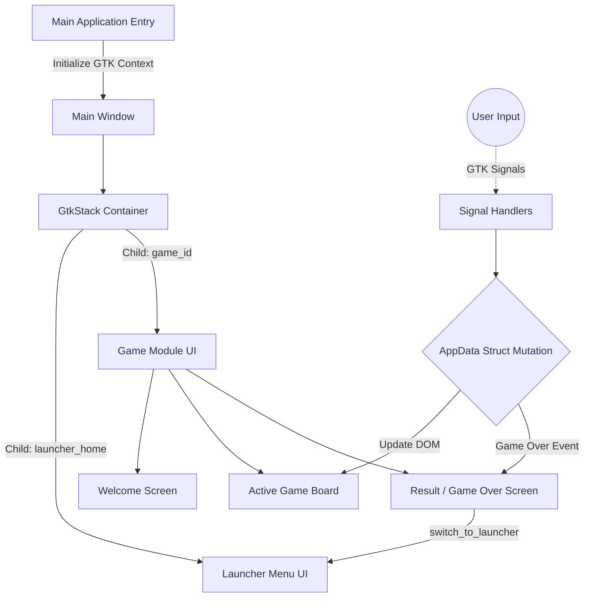

# System Architecture & Design

This document details the internal architecture, design boundaries, and state-management protocols of the **C Games Collection**. It serves as the primary technical reference for contributors maintaining or scaling the system.

## 1. Unified Binary & View Management

The repository employs a **Unified Binary Architecture** managed by a central GTK event loop. Rather than spawning independent executables for each game, all modules are compiled into a single application (`c-games-collection.exe`).

### View Navigation Flow
When a user launches the application:
1. The main entry point initializes the GTK4 application and constructs a global `GtkStack`.
2. The `GtkStack` acts as a container, holding the launcher menu and every game as separate child views.
3. When a user selects a game from the launcher menu, the application invokes `gtk_stack_set_visible_child_name` to transition the view smoothly.
4. When the user clicks "Return to Main Menu" from within a game, the game invokes the `switch_to_launcher()` shared function (transitioning the stack back to the menu) and resets its internal logic cleanly.

**Design Rationale:**
A unified binary eliminates the overhead of managing OS-level processes. It provides instant, seamless transitions between games, mimicking a monolithic engine while keeping the distribution to a single, portable executable.

### Architecture Diagram


## 2. Strict State Encapsulation (`AppData`)

In legacy C GUI development, global variables are frequently abused to track widgets and state across callback scopes. This repository enforces a **zero-global-state policy** for game modules.

Every game module must define an `AppData` struct inside its `main.c` to encapsulate its internal state exclusively:

```c
// Example AppData Pattern Definition
typedef struct {
    int current_score;
    char player_name[50];
    
    // UI Widget References
    GtkWidget *window;
    GtkWidget *stack;
    GtkWidget *score_label;
} AppData;
```

During module initialization, `AppData` is allocated dynamically on the heap using `g_new0`, and a pointer to this context object is passed explicitly into every GTK signal handler as the `user_data` argument. 
This guarantees that memory from one game module cannot leak or interfere with another session, simulating strict process isolation within a unified binary.

## 3. Data Persistence Engine

The project implements a centralized, decoupled data storage layer located in `src/common/persistence.c`. 
It utilizes the `GKeyFile` engine provided by GLib to parse and safely write standard INI configuration files to the local disk (specifically the `data/` directory).

**Engine Guarantees:**
- Provides atomic, safe saves for high scores and application configurations.
- Integrates automatically with GTK-compliant structured logging (`g_message`, `g_warning`) for all I/O operations.
- Strictly decouples file I/O thread operations from UI rendering logic.

## 4. UI Rendering & CSS Decoupling

GTK4 supports XML (`.ui` files) or programmatic C instantiation for constructing the widget tree. 
This repository opts exclusively for **programmatic instantiation** in C to keep build dependencies minimal and compilation speeds high.

Styling, however, is strictly decoupled from the source code into `.css` assets located in `assets/css/`.

When the application starts, `load_css_from_file()` calculates an absolute path to the styling assets, dynamically streams the CSS into a global `GtkCssProvider`, and binds it natively to the `GdkDisplay`. This enables rapid, hot-reloadable styling iteration across all integrated modules without requiring a recompilation step.
