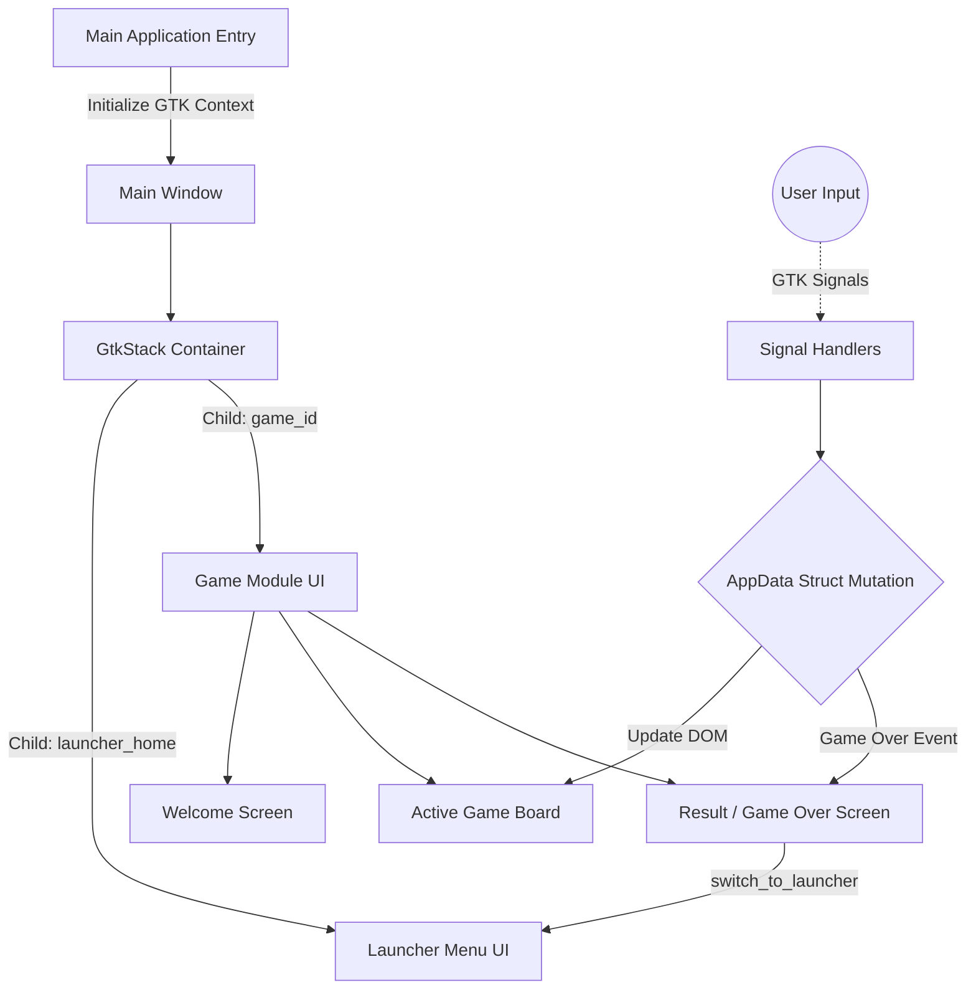

# System Architecture & Design

This document details the internal architecture, design boundaries, and state-management protocols of the **C Games Collection**. It serves as a technical reference for contributors maintaining or extending the system.

## 1. Unified Binary & View Management

The project uses a **Unified Binary Architecture** managed by a single GTK event loop. Instead of spawning independent executables for each game, all modules are compiled into one application (`c-games-collection.exe`).

### View Navigation Flow
The view navigation operates as follows:
1. The main entry point initializes the GTK4 application and constructs a global `GtkStack`.
2. The `GtkStack` acts as a container. It holds the launcher menu and each game as separate child views.
3. When a user selects a game from the launcher menu, the application calls `gtk_stack_set_visible_child_name` to transition the view.
4. When the user clicks "Return to Main Menu" from within a game, the game invokes the `switch_to_launcher()` shared function. This transitions the stack back to the menu and resets the game's internal logic.

**Design Rationale:**
A unified binary eliminates the overhead of managing OS-level processes. It provides immediate transitions between games, simulating a monolithic engine while keeping the distribution to a single executable.

### Architecture Diagram

```mermaid
graph TD
    A[Main Application Entry] -->|Initialize GTK Context| B[Main Window]
    B --> C[GtkStack Container]
    
    C -->|Child: launcher_home| D[Launcher Menu UI]
    C -->|Child: game_id| E[Game Module UI]
    
    E --> F[Welcome Screen]
    E --> G[Active Game Board]
    E --> H[Result / Game Over Screen]
    
    U((User Input)) -.->|GTK Signals| I[Signal Handlers]
    I --> J{AppData Struct Mutation}
    J -->|Update DOM| G
    J -->|Game Over Event| H
    H -->|switch_to_launcher| D
```

## 2. Strict State Encapsulation (`AppData`)

To avoid the memory leaks and cross-contamination issues common in legacy C GUI development, this repository enforces a **zero-global-state policy** for game modules.

Every game module must define an `AppData` struct inside its `main.c` file. This struct must encapsulate its internal state exclusively:

```c
// Example AppData Pattern Definition
typedef struct {
    int current_score;
    char player_name[50];
    
    // UI Widget References
    GtkWidget *window;
    GtkWidget *stack;
    GtkWidget *score_label;
} AppData;
```

During module initialization, `AppData` is allocated dynamically on the heap using `g_new0`. A pointer to this context object is passed explicitly into every GTK signal handler as the `user_data` argument.

**Design Rationale:**
This approach guarantees that memory from one game module cannot leak into or interfere with another session, establishing effective process isolation within the unified binary.

## 3. Data Persistence Engine

The project implements a centralized, decoupled data storage layer in `src/common/persistence.c`.
It uses the `GKeyFile` engine provided by GLib to parse and write standard INI configuration files to the local disk (specifically the `data/` directory).

**Engine Characteristics:**
- Provides atomic saves for high scores and application configurations.
- Integrates with GTK-compliant structured logging (`g_message`, `g_warning`) for all I/O operations.
- Decouples file I/O operations from UI rendering logic.

## 4. UI Rendering & CSS Decoupling

While GTK4 supports XML (`.ui` files) for constructing the widget tree, this repository uses **programmatic instantiation** in C. This decision keeps build dependencies minimal and compilation times short.

Styling is decoupled from the source code and stored in `.css` assets located in `assets/css/`.

When the application starts, `load_css_from_file()` calculates an absolute path to the styling assets. It loads the CSS into a global `GtkCssProvider` and binds it natively to the `GdkDisplay`. This enables styling iteration across all integrated modules without requiring recompilation.
