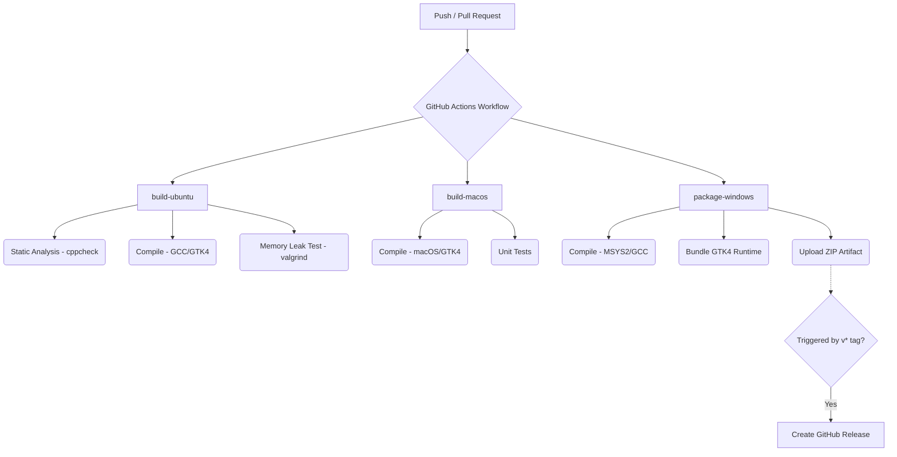

# Continuous Integration and Continuous Deployment (CI/CD) Architecture

This document details the CI/CD pipeline infrastructure for the C Games Collection. The pipeline is engineered to meet professional industry standards, focusing on **security (least privilege)**, **reliability (strict fail-fast mechanisms)**, and **automated distribution**.

## Overview

The pipeline utilizes GitHub Actions and is defined in `.github/workflows/build.yml`. It is triggered automatically on:
- Pushes to the `main` branch.
- Pull Requests targeting the `main` branch.
- Tags matching the version pattern `v*`.

### High-Level Architecture

## Security Posture & Permissions

Following the principle of **least privilege**, the pipeline is designed to minimize attack vectors in the event of compromised dependencies:
- **Global Permissions**: Set to `contents: read`. The CI jobs (`build-ubuntu`, `build-macos`) have no ability to modify the repository or create releases.
- **Job-Specific Permissions**: Only the `package-windows` job is explicitly granted `contents: write`, and this is strictly utilized for cutting automated releases via the `softprops/action-gh-release@v2` action.

## CI: Code Quality & Testing

The Continuous Integration (CI) process strictly enforces code quality standards. If any step fails, the build is immediately halted.

### Ubuntu Build & Test (`build-ubuntu`)
This job acts as the primary quality gate:
1. **Static Analysis**: `cppcheck` is configured with `--enable=warning,performance,portability` and `--error-exitcode=1`. This guarantees that the build will fail immediately if potential bugs, memory safety issues, or non-portable code are detected, preventing flawed code from being merged.
2. **Compilation**: Verifies successful compilation under Linux using GCC with strict flags (`-Wall -Wextra -Werror`).
3. **Memory Testing**: The persistence unit test suite is executed under `valgrind --leak-check=full --error-exitcode=1`. This ensures there are zero memory leaks in the core logic layers.

### macOS Build (`build-macos`)
This job ensures continuous cross-platform portability for Apple Silicon and Intel architectures. 
- Homebrew is used to provision GTK4.
- The pipeline utilizes `brew update` to prevent flakiness associated with outdated Homebrew package indexes.

## CD: Automated Packaging and Release

The Continuous Deployment (CD) pipeline abstracts away the complexity of GTK4 distribution on Windows, producing a portable, zero-install artifact.

### Windows Packaging (`package-windows`)
1. **Environment Setup**: A pristine MSYS2 UCRT64 environment is provisioned on demand.
2. **Packaging Script**: The `scripts/package-windows.sh` script compiles the executable and recursively collects all necessary GTK4 DLLs, GSettings schemas, and icon themes required to run the game natively on Windows without an existing GTK installation.
3. **Artifact Retention**: A ZIP archive (e.g., `C-GAMES-COLLECTION-v2.0.0-Windows.zip`) is generated and attached to the workflow run as a downloadable build artifact.
4. **Automated Releases**: If the pipeline execution was triggered by a version tag (e.g., `git tag v2.0.0`), the workflow automatically drafts a new GitHub Release and attaches the Windows portable archive.
