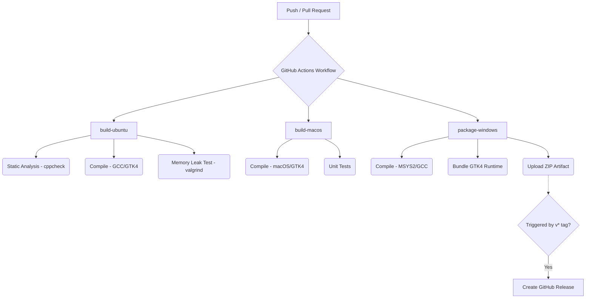

# Continuous Integration and Continuous Deployment (CI/CD) Architecture

This document outlines the CI/CD pipeline infrastructure for the C Games Collection. The pipeline is designed around the principles of least privilege, strict fail-fast mechanisms, and automated distribution.

## Overview

The pipeline uses GitHub Actions and is defined in `.github/workflows/build.yml`. It triggers on:
- Pushes to the `main` branch.
- Pull Requests targeting the `main` branch.
- Tags matching the version pattern `v*`.

### High-Level Architecture

```mermaid
graph TD
    A[Push / Pull Request] --> B{GitHub Actions Workflow}
    B --> C[build-ubuntu]
    B --> D[build-macos]
    B --> E[package-windows]
    
    C --> C1(Static Analysis - cppcheck)
    C --> C2(Compile - GCC/GTK4)
    C --> C3(Memory Leak Test - valgrind)
    
    D --> D1(Compile - macOS/GTK4)
    D --> D2(Unit Tests)
    
    E --> E1(Compile - MSYS2/GCC)
    E --> E2(Bundle GTK4 Runtime)
    E --> E3(Upload ZIP Artifact)
    
    E3 -.-> F{Triggered by v* tag?}
    F -- Yes --> G[Create GitHub Release]
```

## Security Posture & Permissions

Following the principle of least privilege, the pipeline minimizes access to reduce attack vectors if dependencies are compromised:
- **Global Permissions**: Set to `contents: read`. The CI jobs (`build-ubuntu`, `build-macos`) cannot modify the repository or create releases.
- **Job-Specific Permissions**: Only the `package-windows` job receives `contents: write`. This permission is used exclusively for generating automated releases via the `softprops/action-gh-release@v2` action.

## CI: Code Quality & Testing

The Continuous Integration (CI) pipeline enforces code quality. If any step fails, the pipeline halts immediately.

### Ubuntu Build & Test (`build-ubuntu`)
This job serves as the primary verification gate:
1. **Static Analysis**: Executes `cppcheck` with `--enable=warning,performance,portability` and `--error-exitcode=1`. This step fails the build if potential bugs, memory safety issues, or non-portable code are detected.
2. **Compilation**: Verifies successful compilation on Linux using GCC with strict compiler flags (`-Wall -Wextra -Werror`).
3. **Memory Testing**: Runs the persistence unit test suite using `valgrind --leak-check=full --error-exitcode=1`. This step verifies that the core logic layers contain no memory leaks.

### macOS Build (`build-macos`)
This job validates cross-platform compilation on Apple Silicon and Intel architectures.
- The pipeline uses Homebrew to provision GTK4.
- It executes `brew update` before installation to mitigate build failures caused by outdated Homebrew package indexes.

## CD: Automated Packaging and Release

The Continuous Deployment (CD) pipeline automates GTK4 distribution on Windows, outputting a portable artifact that requires no installation.

### Windows Packaging (`package-windows`)
1. **Environment Setup**: Provisions an MSYS2 UCRT64 environment.
2. **Packaging Script**: Executes `scripts/package-windows.sh`. This script compiles the binary and bundles the necessary GTK4 DLLs, GSettings schemas, and icon themes. This allows the application to execute on a Windows machine without an existing GTK installation.
3. **Artifact Retention**: Generates a ZIP archive (e.g., `C-GAMES-COLLECTION-v2.0.0-Windows.zip`) and attaches it to the workflow run for download.
4. **Automated Releases**: If a version tag (e.g., `git tag v2.0.0`) triggered the run, the workflow drafts a GitHub Release and attaches the ZIP archive automatically.
